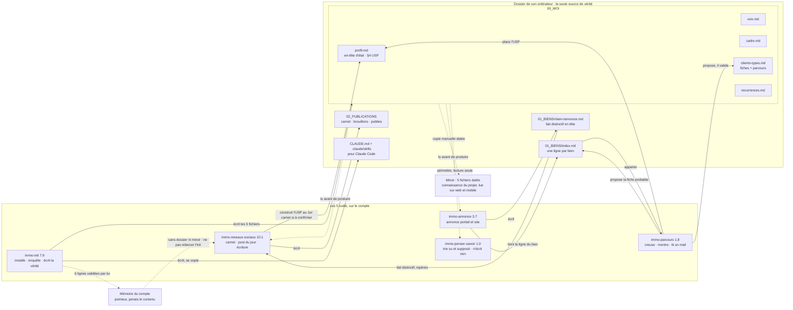

# Mallette IA pour agents immobiliers

**Cinq outils pour Claude qui connaissent votre métier, votre voix et vos clients — et qui ne publient jamais rien à votre place.**

[](https://github.com/agencekoeki/Claude-marketing-for-real-estate/releases/latest)
[](https://github.com/agencekoeki/Claude-marketing-for-real-estate/actions/workflows/controle.yml)
[](LICENSE)


> Conçue par **Sébastien Grillot** pour sa formation IA des agents immobiliers, avec **Boost Academy**.
> Projet indépendant : Claude est une marque d'Anthropic, et ce projet n'est ni affilié à Anthropic, ni approuvé par elle.


*Un carrousel fabriqué par la mallette pour une agente fictive : le texte validé d'abord, puis un PDF pour LinkedIn et une image par diapo pour Instagram et Facebook.*

## Ce que ça change, en 30 secondes

| Outil | Vous demandez | Vous obtenez |
|---|---|---|
| **immo-init** | « installe ma mallette » | votre profil, votre voix, votre cadre et vos clients types, écrits dans votre dossier |
| **immo-parcours** | « montre-moi mon parcours vendeur » | vos fiches clients types, votre parcours client, votre différence placée où elle se voit |
| **immo-annonce** | « l'annonce du T3 que je viens de rentrer » | une annonce vérifiée fait par fait, et l'ordre des photos |
| **immo-reseaux-sociaux** | « qu'est-ce que je publie aujourd'hui ? » | le post du jour, décliné par plateforme, avec son visuel ou son carrousel prêt à téléverser |
| **immo-penser-savoir** | « c'est vrai, ce que dit ChatGPT ? » | ce qui est su, ce qui est supposé, et la question qui tranche |

## Installer

**Il vous faut** un abonnement Claude payant — Pro, Max ou Team — et l'exécution de code activée dans les réglages de Claude.

### Claude Desktop ou claude.ai, par la place de marché — recommandé

1. Dans Claude Desktop ou sur claude.ai, ouvrez **Personnaliser**, puis l'onglet **Plugins** — pas celui des connecteurs.
2. Cliquez sur **Ajouter** (ou **+**), puis **Ajouter une place de marché** › **Ajouter à partir d'un référentiel**, et collez : `https://github.com/agencekoeki/Claude-marketing-for-real-estate`, puis validez : la synchronisation démarre.
3. Sur la ligne **Mallette immo**, cliquez sur **Ajouter** : le plugin doit annoncer 5 compétences.

Pour les mises à jour, resynchronisez cette place de marché depuis le même onglet. Les intitulés des menus peuvent varier selon la version de l'application : le [guide d'installation](docs/installer.md) détaille chaque cas.

### Par fichiers, dans claude.ai

Téléchargez les cinq outils de la dernière version — en `.zip` ou en `.skill`, c'est le même contenu —, puis importez-les un par un dans **Personnaliser › Compétences**, sans les décompresser :

| Outil | Télécharger |
|---|---|
| immo-init | [.zip](https://github.com/agencekoeki/Claude-marketing-for-real-estate/releases/latest/download/immo-init.zip) · [.skill](https://github.com/agencekoeki/Claude-marketing-for-real-estate/releases/latest/download/immo-init.skill) |
| immo-parcours | [.zip](https://github.com/agencekoeki/Claude-marketing-for-real-estate/releases/latest/download/immo-parcours.zip) · [.skill](https://github.com/agencekoeki/Claude-marketing-for-real-estate/releases/latest/download/immo-parcours.skill) |
| immo-annonce | [.zip](https://github.com/agencekoeki/Claude-marketing-for-real-estate/releases/latest/download/immo-annonce.zip) · [.skill](https://github.com/agencekoeki/Claude-marketing-for-real-estate/releases/latest/download/immo-annonce.skill) |
| immo-reseaux-sociaux | [.zip](https://github.com/agencekoeki/Claude-marketing-for-real-estate/releases/latest/download/immo-reseaux-sociaux.zip) · [.skill](https://github.com/agencekoeki/Claude-marketing-for-real-estate/releases/latest/download/immo-reseaux-sociaux.skill) |
| immo-penser-savoir | [.zip](https://github.com/agencekoeki/Claude-marketing-for-real-estate/releases/latest/download/immo-penser-savoir.zip) · [.skill](https://github.com/agencekoeki/Claude-marketing-for-real-estate/releases/latest/download/immo-penser-savoir.skill) |

Sur la [page des versions](https://github.com/agencekoeki/Claude-marketing-for-real-estate/releases/latest), ne prenez pas les archives « Source code » : c'est le dépôt entier, pas un outil à importer.

### Claude Code

```
/plugin marketplace add agencekoeki/Claude-marketing-for-real-estate
/plugin install mallette-immo@sebastien-grillot
```

Dans Claude Code, les scripts de la mallette tournent sur votre ordinateur : il y faut Python 3, et pour les carrousels les bibliothèques reportlab, Pillow et pypdf. L'outil **immo-init** vérifie tout cela, et vous guide si quelque chose manque.

## Premier pas

Ouvrez Claude Desktop sur un projet relié à un dossier de votre ordinateur, tapez « / » et choisissez **immo-init**. L'outil pose ses questions, puis écrit votre profil dans ce dossier — c'est ce profil que les quatre autres outils liront.

## Ce qui marche où — septembre 2026

| Où vous travaillez | Ce que la mallette fait |
|---|---|
| Claude Desktop, avec un dossier de votre ordinateur | tout : installation, annonces, publications, carrousels, tableau de bord |
| claude.ai dans le navigateur, application mobile | la production sans dossier : chaque fichier fabriqué part dans votre stockage en ligne, ou se télécharge |
| Claude Code, ouvert dans le dossier | les outils et leurs scripts ; ce qui dépend de votre compte Claude — projets, mémoire — n'y est pas |

Les applications Claude évoluent vite. Un écart entre ce tableau et ce que vous voyez ? [Signalez-le](https://github.com/agencekoeki/Claude-marketing-for-real-estate/issues/new/choose).

## Les règles que la mallette ne négocie pas

- **Votre dossier est la seule vérité.** Rien n'est inventé sur vous : ce qui manque est marqué « à confirmer ».
- **Rien n'est publié ni envoyé sans vous.** La mallette prépare des brouillons ; c'est vous qui publiez.
- **Aucune image générée ne représente un bien réel.**
- **Un chiffre sans source ne sort pas.**
- **Ce qui est su et ce qui est supposé ne s'écrivent pas pareil.**

## Vos données

Vos fichiers restent dans votre dossier. Selon le mode de la session, Claude les traite sur les serveurs d'Anthropic ou sur votre ordinateur, comme pour tout usage de Claude. Les scripts de la mallette ne contactent aucun service : ils lisent et écrivent dans votre dossier, rien d'autre. La mallette ne lit ni la mémoire de votre compte ni vos conversations passées, sauf si vous le demandez. Aucun nom de client, aucune coordonnée ne va dans une publication ni dans la mémoire de votre compte.

## Exemples

Cinq demandes, une par outil, avec ce qu'elles produisent : [les exemples](docs/exemples.md). Pour essayer sans rien renseigner sur vous, reliez comme dossier de travail le dossier d'une agente inventée : [exemples/agent-fictif](exemples/agent-fictif/).

## Mettre à jour

- **Par la place de marché** : resynchronisez-la dans **Personnaliser › Plugins**. Dans Claude Code, en terminal : `claude plugin marketplace update sebastien-grillot`, puis `claude plugin update mallette-immo@sebastien-grillot`, puis redémarrez Claude Code.
- **Par fichiers** (`.zip` ou `.skill`) : réimportez les outils de la [dernière version](https://github.com/agencekoeki/Claude-marketing-for-real-estate/releases/latest).
- Chaque outil connaît l'adresse de ce dépôt : demandez-lui « y a-t-il une mise à jour ? ».

## Pour les formateurs et les curieux

La mallette est un système : un outil installe et écrit la vérité, les autres la lisent. Chaque outil énonce son déroulé dans un seul fichier, et un script [contrôle à chaque modification](https://github.com/agencekoeki/Claude-marketing-for-real-estate/actions/workflows/controle.yml) que les fichiers se répondent — versions, contrats entre outils, cartes, moteur de visuels.



- `skills/` — les cinq outils, lisibles tels quels
- `skills/immo-init/references/maintenance.md` — les décisions tranchées, la publication d'une version, les scénarios de test
- `python3 skills/immo-init/scripts/verifier-mallette.py skills --moteur` — le contrôle, sur votre machine
- une idée, un problème : [ouvrez un signalement](https://github.com/agencekoeki/Claude-marketing-for-real-estate/issues/new/choose)

## Support

- **Un problème, une question** : [ouvrez un signalement](https://github.com/agencekoeki/Claude-marketing-for-real-estate/issues/new/choose). Le formulaire demande la surface, l'outil et sa version — jamais une donnée de client.
- **Contact** : hello@boostacademy.ai
- **Une faille de sécurité** : écrivez à cette adresse plutôt que dans un signalement public.

## La formation

Cette mallette accompagne la formation IA des agents immobiliers de Sébastien Grillot, avec [Boost Academy](https://boostacademy.ai/) : en présentiel ou à distance, sur vos propres cas.

## L'auteur

**Sébastien Grillot** — consultant SEO & IA, formateur, fondateur de Koeki.
[Son parcours](https://sebastiengrillot.com/a-propos/) · [LinkedIn](https://www.linkedin.com/in/consultant-seo-ia-automatisation/) · [Boost Academy](https://boostacademy.ai/) · [Koeki](https://koeki.fr)

## Licence

GPL 3.0 — voir [LICENSE](LICENSE). La police Liberation Sans, livrée avec le moteur de visuels, reste sous licence SIL Open Font License 1.1 : [OFL.txt](skills/immo-reseaux-sociaux/assets/polices/OFL.txt).

Claude est une marque d'Anthropic. Ce projet est indépendant : il n'est ni affilié à Anthropic, ni approuvé par elle.

[Read this in English](README.en.md)
