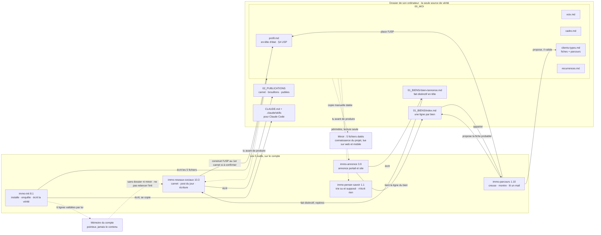

# Carte de la mallette — qui écrit, qui lit

**Pour la maintenance seulement : ne la lis pas pour travailler.** La table qui fait foi est
dans `verite.md`. Cette carte le résume, et le script de maintenance vérifie qu'elle porte
exactement les mêmes étapes. Si elles divergent, c'est la carte qu'on corrige.

