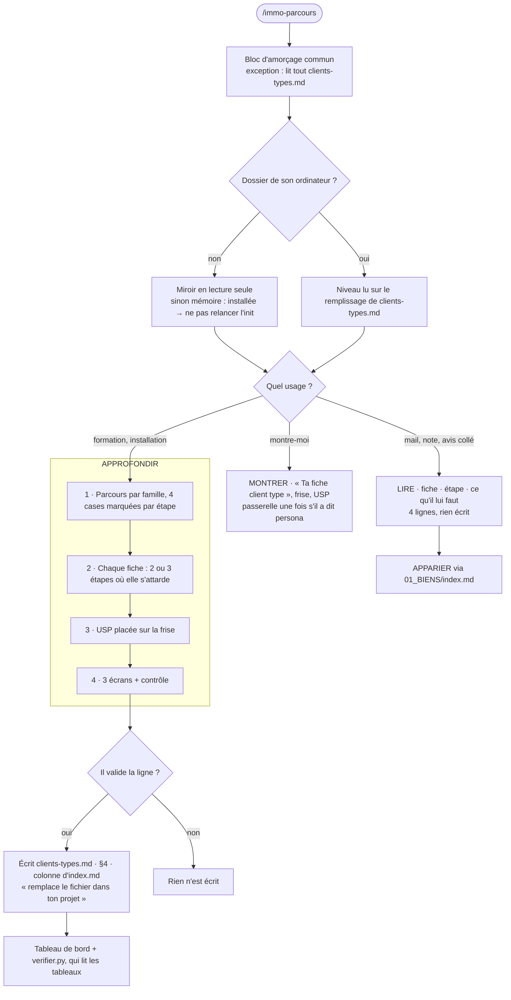

# Carte du déroulé — immo-parcours

**Pour la maintenance seulement : ne la lis pas pour travailler.** Le déroulé qui fait foi est
dans `SKILL.md`. Cette carte le résume, et le script de maintenance vérifie qu'elle porte
exactement les mêmes étapes. Si elles divergent, c'est la carte qu'on corrige.

